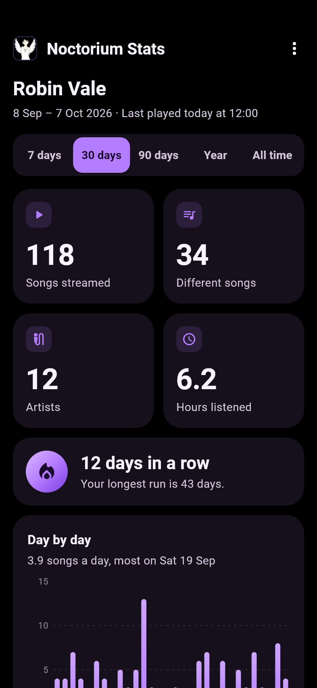
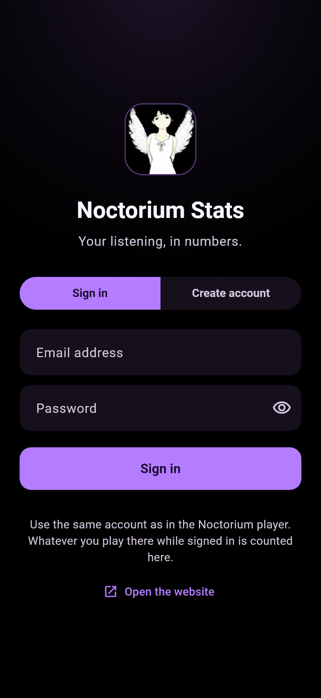

# Noctorium Stats for Android

What you have been listening to, on your phone. Noctorium Stats signs in to your Noctorium account and
shows the statistics the [Noctorium service](https://github.com/Noctorium/Noctorium-Service) keeps: what the
player records while you are signed in to it, counted over the last week, month, three months, year, or
everything. It is the phone's half of a pair — the desktop's is
[Noctorium-Stats-Desktop](https://github.com/Noctorium/Noctorium-Stats-Desktop) — and the same figures are
on the website, at [noctorium-service.vercel.app](https://noctorium-service.vercel.app).

It is written in Dart with Flutter, for Android 8.0 and later.

<p align="center">
  
  
</p>

## What it shows

For whichever range is chosen — **7 days**, **30 days**, **90 days**, **Year** or **All time**, remembered
from one launch to the next:

- four figures: songs streamed, different songs, artists, and hours listened;
- the streak: days in a row with something played, and the longest run there has been, which is about you
  rather than the range;
- the timeline, a bar for every day — or every month, once a range is longer than about four months —
  with the quiet ones drawn as quiet rather than left out;
- the split by service, in each service's own colour, with YouTube videos counted as YouTube Music;
- the top songs and the top artists, ten of each, with plays and time;
- the hours of the day as a clock face, midnight at the top, and the days of the week as bars;
- the last thirty songs played.

Every day, hour and weekday is on the phone's own clock: the app tells the service how far the phone is
from UTC, so a song at eleven at night belongs to that evening rather than to the next morning somewhere
else. Times are written on a 24-hour or a 12-hour clock, as the phone is set.

Pull down, or **Refresh** in the menu, to count again. Nothing played yet says what to do about it — play
something in Noctorium while signed in — and a range with nothing in it offers a longer one. With no
connection the app says so and offers to try again; a refresh that fails keeps what is already on screen
and says it is not up to date. A sign-in the service no longer accepts — tokens last 90 days, and signing
out elsewhere ends them — goes back to the sign-in screen and says why.

## Signing in

With the same account the player uses. **Create account** makes one here, or the website does; either way,
what is counted is what the Noctorium player records while it is signed in to the same account. The token
the service hands back is kept in Android's keystore through
[flutter_secure_storage](https://pub.dev/packages/flutter_secure_storage) and nowhere else: backups are off
for this application, because a token restored onto another phone is a sign-in that phone was never given.
**Sign out** in the menu forgets it.

At launch the app asks GitHub, once, whether a newer Noctorium release is out, and if one is says so in a
line at the foot of the page with a link to it. Nothing is downloaded, and a check that fails says nothing.

## Getting it

Every Noctorium release carries `Noctorium-Stats-<version>.apk` beside Noctorium's own, on
[the releases page](https://github.com/Noctorium/Noctorium-Installer/releases/latest), signed with the same
key as Noctorium — certificate SHA-256 fingerprint
`46:CF:8B:96:C4:37:49:7A:93:AF:76:2B:91:94:AD:11:09:5D:D6:4A:B6:AB:EA:E9:60:C0:A5:98:C5:63:49:ED`. It
installs beside Noctorium as its own application, `app.noctorium.stats`.

## Building

With Flutter 3.47.6 and a Java 17 or newer:

```bash
flutter pub get
flutter analyze
flutter test                     # every test, the screenshots included
flutter build apk --debug        # build/app/outputs/flutter-apk/app-debug.apk
```

A debug build is `app.noctorium.stats.debug`, called *Noctorium Stats (debug)* on the launcher, so it
installs beside a released one rather than replacing it, and says it is a debug build beside its version.

### Against a local service

The service runs on a computer with made-up data (`npm run dev:local` in Noctorium-Service, then
`node scripts/seed-local.mjs` for its test accounts). A debug build talks to it over the USB cable:

```bash
flutter build apk --debug --dart-define=NOCTORIUM_SERVICE_URL=http://localhost:3000
adb reverse tcp:3000 tcp:3000        # the phone's localhost:3000 is the computer's
adb install -r build/app/outputs/flutter-apk/app-debug.apk
adb reverse --remove tcp:3000        # afterwards
```

Plain http is allowed to `localhost` and `127.0.0.1` in debug builds only. Android is told so in
`android/app/src/debug/res/xml/network_security_config.xml`, which release builds do not have — but Dart's
own HTTP client never reads that file, so `NoctoriumService` applies the same rule itself and refuses,
before sending anything, to talk to any other address over plain http. A release build talks to
`https://noctorium-service.vercel.app` unless built with another `NOCTORIUM_SERVICE_URL`, and that one has to
be https.

### Tests, and pictures of every screen

`flutter test` runs the unit tests — reading statistics captured from a local service
(`test/fixtures/`, every artist and name in them invented), the formatting, the requests, and how each
failure is put into words — and the widget tests, which drive the whole application against a pretend
service, including every screen at twice the ordinary text size, the largest Android offers.

`test/golden_test.dart` draws every screen into `test/goldens/` — signing in, the dashboard for 7 days, 30
days and all time, an account with nothing played, offline, the service having trouble — at the ordinary
text size and at twice it, the whole length of each page. To look at a change:

```bash
flutter test --update-goldens --tags golden
```

They are drawn in Roboto, taken from the Flutter SDK by `test/flutter_test_config.dart`. The same picture
drawn on Linux differs from Windows' in the last pixel of every letter, so CI runs
`flutter test --exclude-tags golden` and the pictures are checked on the machine that drew them.

## Releasing

Noctorium-Installer's release workflow builds this repository at the release tag `vX.Y.Z`, as it does
Noctorium's own APK. The version comes from the tag: `--build-name` is the version, and `--build-number`
packs it as Noctorium's `versionCode` is packed, `major * 10000 + minor * 100 + patch` — `0.13.0` is
`1300`. The signing key comes from the same four variables Noctorium's build reads; without them the APK is
signed with the debug key, which installs but can never be updated by a properly signed one.

```bash
flutter pub get
NOCTORIUM_KEYSTORE=/path/to/noctorium.jks \
NOCTORIUM_KEYSTORE_PASSWORD=... \
NOCTORIUM_KEY_ALIAS=... \
NOCTORIUM_KEY_PASSWORD=... \
flutter build apk --release --build-name 0.13.0 --build-number 1300
```

From a tag in a workflow, where `APP_VERSION` is `v0.13.0` (or `v0.13.0-beta.1`, which is built as
`0.13.0-beta.1` with the code of `0.13.0`):

```bash
version="${APP_VERSION#v}"
IFS=. read -r major minor patch <<< "${version%%-*}"
flutter build apk --release --build-name "$version" --build-number "$((major * 10000 + minor * 100 + patch))"
```

The APK is `build/app/outputs/flutter-apk/app-release.apk` — one file for every processor Android runs on —
and the pipeline renames it `Noctorium-Stats-<version>.apk` before attaching it to the release.
`apksigner verify --print-certs` on it should show the fingerprint above.

## Licence

GPL-3.0, like the rest of Noctorium. See [LICENSE](LICENSE).
